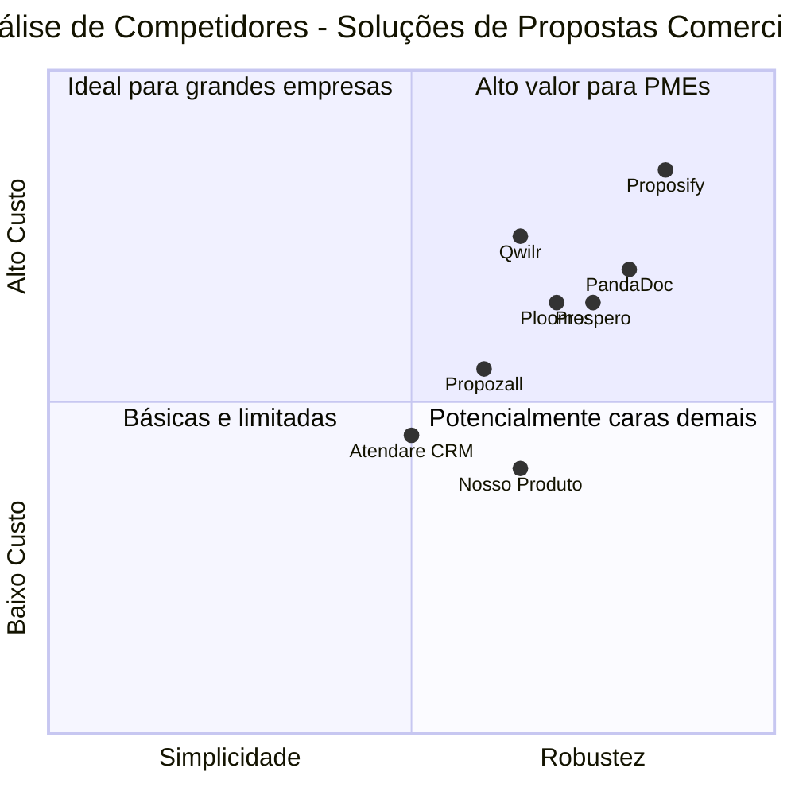

# Documento de Requisitos do Produto (PRD)

## Sistema de Geração e Envio de Propostas Comerciais em PDF com Plano SaaS

*Data: 21 de Maio de 2025*

## Índice

1. [Visão Geral do Produto](#1-visão-geral-do-produto)
2. [Análise de Mercado](#2-análise-de-mercado)
3. [Personas e Jornadas de Usuário](#3-personas-e-jornadas-de-usuário)
4. [Definição do Produto](#4-definição-do-produto)
5. [Especificações Funcionais](#5-especificações-funcionais)
6. [Especificações Técnicas](#6-especificações-técnicas)
7. [Requisitos de Segurança](#7-requisitos-de-segurança)
8. [Modelos de Negócio e Planos](#8-modelos-de-negócio-e-planos)
9. [Análise Competitiva](#9-análise-competitiva)
10. [Questões em Aberto](#10-questões-em-aberto)

---

## 1. Visão Geral do Produto

### 1.1 Requisitos Originais

Desenvolvimento de um sistema full-stack para geração e envio de propostas comerciais em PDF com modelo de negócio SaaS, utilizando as seguintes tecnologias:

**Frontend:**
- React + TypeScript
- Tailwind CSS
- React Router DOM v6+
- React Hook Form com Zod ou Yup
- Axios com JWT interceptors
- PDFMake ou html2pdf.js
- Framer Motion ou ShadCN UI

**Backend:**
- Spring Boot 3 com Spring Web
- Spring Security com autenticação JWT
- Spring Data JPA com PostgreSQL
- Flyway ou Liquibase
- Spring Scheduler para envio automático
- Thymeleaf (opcional para geração de PDF)

**Pagamento:**
- Stripe API para SaaS (recorrente)
- MercadoPago como alternativa

**Armazenamento:**
- PostgreSQL
- Amazon S3 ou Firebase Storage
- Redis (opcional)

**Segurança:**
- JWT com refresh token
- Senhas com BCrypt
- Multi-tenant básico com usuario_id
- Controle de acesso por perfil (admin, comum, premium)

**Infraestrutura:**
- Docker
- Docker Compose
- GitHub Actions
- Render.com / Railway / Fly.io
- Vercel / Netlify para o frontend

**Funcionalidades esperadas:**
- Tela de login e cadastro de usuários
- Criação de propostas com cliente, valores, serviços, prazos
- Seleção de template visual
- Geração de proposta em PDF ou link público
- Envio por e-mail ou WhatsApp (manual ou automático)
- Registro de visualização com IP, data e hora (view_event)
- (Opcional) Assinatura digital: aceitar ou rejeitar proposta
- Histórico de status: criada, enviada, visualizada, aceita, rejeitada
- Plano gratuito e plano pago com recursos premium

### 1.2 Objetivos do Produto

1. **Automatizar e simplificar** o processo de criação, gestão e envio de propostas comerciais para empresas de todos os tamanhos

2. **Aumentar a taxa de conversão** de propostas comerciais através de monitoramento em tempo real, templates profissionais e facilidade de aceitação

3. **Oferecer escalabilidade** para empresas em crescimento através de um modelo SaaS com diferentes planos e funcionalidades

### 1.3 Público-Alvo

- Empresas de pequeno e médio porte que necessitam de um sistema para gerenciar propostas comerciais
- Profissionais autônomos, consultores e freelancers
- Equipes de vendas e marketing que precisam agilizar o processo de propostas comerciais
- Empresas que desejam profissionalizar e padronizar seu processo de propostas

## 2. Análise de Mercado

### 2.1 Visão Geral do Mercado

O mercado brasileiro de sistemas de geração de propostas comerciais em modelo SaaS tem apresentado crescimento significativo. De acordo com pesquisas recentes, o mercado global de SaaS atingiu aproximadamente US$ 315 bilhões em 2023 e possui projeção para alcançar quase US$ 1,3 trilhão até 2034.

No Brasil, empresas têm buscado cada vez mais soluções que otimizem seus processos comerciais, especialmente aquelas que permitem:

- Redução no tempo de elaboração de propostas
- Padronização dos documentos comerciais
- Monitoramento do status das propostas enviadas
- Aumento nas taxas de conversão

### 2.2 Tendências do Mercado

1. **Automatização de processos comerciais**: empresas buscam reduzir tempo e custos em tarefas repetitivas

2. **Personalização em escala**: necessidade de criar propostas personalizadas mantendo a identidade visual e padrões da empresa

3. **Análise de dados em tempo real**: demanda por insights sobre o comportamento do cliente ao interagir com propostas

4. **Integração omnichannel**: envio e acompanhamento de propostas por diferentes canais (e-mail, WhatsApp, links web)

5. **Assinaturas digitais**: crescimento na adoção de ferramentas que permitam fechamento de negócios de forma 100% digital

### 2.3 Tamanho do Mercado

O mercado potencial para este produto inclui:

- Aproximadamente 19 milhões de micro e pequenas empresas no Brasil
- Mais de 8 milhões de MEIs (Microempreendedores Individuais) que precisam de soluções acessíveis
- Empresas de médio porte que buscam otimizar processos comerciais
- Profissionais autônomos e prestadores de serviços

Estima-se um mercado endereçável de mais de R$ 2 bilhões anuais considerando apenas o segmento de automação comercial para micro e pequenas empresas no Brasil.

### 2.4 Problemas Atuais do Mercado

1. **Soluções complexas demais** para pequenas empresas e autônomos

2. **Preços inacessíveis** para micro e pequenos negócios

3. **Falta de integração** com ferramentas populares no mercado brasileiro

4. **Adaptações culturais** insuficientes em soluções internacionais

5. **Suporte técnico deficiente** em português

## 3. Personas e Jornadas de Usuário

### 3.1 Persona Principal: Carlos Silva

**Perfil:**
- 38 anos, dono de uma pequena agência de marketing digital
- 6 funcionários, atende cerca de 15 clientes mensalmente
- Faturamento anual: R$ 480.000

**Problemas:**
- Gasta muito tempo criando propostas no Word/PowerPoint
- Não tem controle sobre o status das propostas enviadas
- Propostas sem padrão visual profissional
- Dificuldade em acompanhar versões e negociações

**Objetivos:**
- Reduzir tempo gasto na criação de propostas
- Melhorar a imagem profissional da empresa
- Aumentar taxa de conversão de propostas
- Ter clareza sobre o pipeline comercial

**Jornada atual:**
1. Cria propostas no Word ou PowerPoint
2. Exporta manualmente para PDF
3. Envia por e-mail aos clientes
4. Faz follow-up por telefone para verificar se o cliente recebeu/leu
5. Negocia alterações por e-mail ou telefone
6. Cria novas versões com ajustes solicitados
7. Confirma aprovação por e-mail
8. Registra manualmente o status em planilha

**Jornada desejada:**
1. Seleciona template pronto no sistema
2. Preenche informações do cliente e detalhes da proposta
3. Sistema gera PDF profissional automaticamente
4. Envia proposta diretamente da plataforma
5. Recebe notificações quando o cliente abre e interage com a proposta
6. Cliente pode aprovar/rejeitar/comentar diretamente no sistema
7. Dashboard mostra status de todas as propostas em tempo real

### 3.2 Persona Secundária: Mariana Oliveira

**Perfil:**
- 29 anos, consultora autônoma em RH
- Atende cerca de 5-8 clientes por mês
- Faturamento anual: R$ 180.000

**Problemas:**
- Dificuldade em criar propostas com aparência profissional
- Tempo excessivo na formatação de documentos
- Insegurança sobre recebimento e leitura das propostas
- Orçamento limitado para ferramentas de negócio

**Objetivos:**
- Automatizar criação de propostas padronizadas
- Parecer mais profissional para grandes clientes
- Acompanhar status das propostas enviadas
- Solução acessível para seu orçamento limitado

**Jornada desejada:**
1. Utiliza plano gratuito ou acessível do sistema
2. Cria rapidamente propostas com templates profissionais
3. Personaliza com sua identidade visual básica
4. Envia propostas pelo sistema e recebe notificações
5. Acompanha status das propostas em dashboard simples

### 3.3 Persona Terciária: Roberto Mendes

**Perfil:**
- 45 anos, diretor comercial de empresa de médio porte
- Equipe com 12 vendedores
- Responsável por vendas de R$ 8 milhões/ano

**Problemas:**
- Falta de padronização nas propostas da equipe
- Dificuldade em monitorar atividades dos vendedores
- Processo manual de aprovação de descontos
- Análise inconsistente de métricas comerciais

**Objetivos:**
- Padronizar processo comercial
- Implementar fluxos de aprovação
- Obter métricas avançadas de desempenho
- Integrar com CRM existente

**Jornada desejada:**
1. Implementa sistema com plano premium/empresarial
2. Configura templates padronizados para toda equipe
3. Define fluxos de aprovação para descontos
4. Acompanha métricas de desempenho por vendedor
5. Analisa taxas de conversão por tipo de proposta/cliente
6. Integra dados com CRM e ferramentas de gestão

## 4. Definição do Produto

### 4.1 Objetivos do Produto

1. **Automatizar e padronizar o processo de criação de propostas comerciais** para empresas de todos os tamanhos

2. **Aumentar a taxa de conversão de propostas** através de templates profissionais, monitoramento em tempo real e facilitação da aprovação

3. **Oferecer escalabilidade** através de um modelo SaaS com diferentes planos adaptáveis ao crescimento dos clientes

### 4.2 Histórias de Usuário

1. **Como** dono de uma pequena empresa, **quero** criar propostas comerciais profissionais rapidamente **para que** eu possa economizar tempo e apresentar uma imagem mais profissional.

2. **Como** vendedor, **quero** receber notificações quando meus clientes visualizarem minhas propostas **para que** eu possa fazer follow-up no momento adequado e aumentar minhas chances de conversão.

3. **Como** consultor autônomo, **quero** ter acesso a templates profissionais de propostas **para que** eu pareça mais estruturado e profissional para meus clientes potenciais.

4. **Como** gerente comercial, **quero** ter visibilidade sobre todas as propostas enviadas pela minha equipe **para que** eu possa monitorar desempenho e melhorar processos.

5. **Como** cliente recebendo uma proposta, **quero** poder visualizar, comentar e aprovar a proposta digitalmente **para que** eu não precise imprimir, assinar e digitalizar documentos.

### 4.3 Análise Competitiva

| Produto | Pontos Fortes | Pontos Fracos |
|---------|--------------|---------------|
| **Prospero** | - Interface amigável - Notificações em tempo real - Análises detalhadas de rastreamento - Mais de 100 modelos - Opções de pagamento integradas - Geração com IA | - Preço elevado para pequenas equipes - Curva de aprendizado inicial |
| **Propozall** | - Interface intuitiva - Assinatura digital com validade jurídica - Sistema integrado de Notas Fiscais - Templates personalizáveis | - Limitações nas integrações - Menos recursos para customização |
| **Proposify** | - Editor de templates fácil de usar - Biblioteca centralizada - Análises detalhadas - Recursos avançados de colaboração - Integrações múltiplas | - Preço inicial elevado - Interface complexa para iniciantes |
| **PandaDoc** | - Templates interativos - Mídia incorporada - Integração com CRM - Assinatura eletrônica nativa | - Limitações na versão gratuita - Customização avançada complexa |
| **Qwilr** | - Propostas como páginas web - Conteúdo multimídia - Análises detalhadas - Integrações com CRM | - Curva de aprendizado para não técnicos - Menos focado em documentos PDF tradicionais |
| **Ploomes** | - Integração completa com CRM - Solução brasileira adaptada ao mercado - Interface em português | - Foco mais amplo que apenas propostas - Menos especializado em templates |
| **Atendare CRM** | - Solução brasileira - Integração nativa com processos locais - Criação rápida de propostas | - Menos recursos avançados - Foco mais amplo em CRM |

### 4.4 Gráfico de Quadrantes Competitivos

## 5. Especificações Funcionais

### 5.1 Funcionalidades Principais

#### 5.1.1 Gestão de Usuários e Contas

- **Cadastro e Login de Usuários**
  - Cadastro com e-mail e senha ou integração com Google/Microsoft
  - Confirmação de e-mail por link
  - Login com autenticação em dois fatores (opcional)
  - Recuperação de senha

- **Perfis e Permissões**
  - Perfil Admin: acesso completo à conta e configurações
  - Perfil Gerente: criação de propostas e visualização de relatórios
  - Perfil Colaborador: apenas criação e gestão de suas próprias propostas
  - Controle granular de permissões para recursos específicos

- **Gestão de Conta e Planos**
  - Visualização e alteração do plano atual
  - Histórico de pagamentos
  - Configurações da conta (logotipo, cores, domínio personalizado)
  - Gestão de membros da equipe e permissões

#### 5.1.2 Criação e Gestão de Propostas

- **Editor de Propostas**
  - Interface drag-and-drop para montagem de propostas
  - Campos dinâmicos baseados em templates
  - Editor de texto rico (formatação, listas, tabelas)
  - Cálculos automáticos para valores, impostos e descontos
  - Versionamento de propostas (histórico de alterações)

- **Banco de Dados de Clientes**
  - Cadastro básico de clientes (nome, e-mail, telefone, empresa)
  - Histórico de propostas por cliente
  - Importação de contatos via CSV/Excel/integração
  - Tags e segmentação de clientes

- **Biblioteca de Conteúdo**
  - Catálogo de produtos/serviços com descrições e valores
  - Textos padronizados para seções comuns (termos, condições)
  - Banco de imagens e recursos visuais
  - Componentes reutilizáveis (tabelas de preços, cronogramas)

#### 5.1.3 Templates e Personalização

- **Templates Padrão**
  - Biblioteca de templates por categoria (consultoria, serviços, produtos)
  - Templates específicos por setor (marketing, TI, contabilidade)
  - Templates básicos (plano gratuito) e premium (planos pagos)

- **Personalização Visual**
  - Customização de cores, fontes e estilos
  - Upload de logotipo e imagens de marca
  - Definição de cabeçalho e rodapé
  - CSS personalizado (planos avançados)

- **Elementos Interativos**
  - Opções selecionáveis pelo cliente
  - Tabelas de preços interativas
  - Campos para feedback ou comentários do cliente
  - Botões de ação (aprovar, rejeitar, solicitar alterações)

#### 5.1.4 Distribuição e Compartilhamento

- **Geração de PDF**
  - Exportação de alta qualidade para PDF
  - Proteção por senha (opcional)
  - Marca d'água personalizada
  - Otimização para impressão

- **Link Web Público**
  - URL única para cada proposta
  - Proteção opcional por senha
  - Expiração configurável
  - Visualização otimizada para dispositivos móveis

- **Envio Direto**
  - Envio por e-mail com mensagem personalizada
  - Agendamento de envios
  - Integração com WhatsApp Business API
  - Notificações programadas de follow-up

#### 5.1.5 Monitoramento e Analytics

- **Rastreamento de Visualizações**
  - Notificações em tempo real quando proposta é aberta
  - Registro de IP, dispositivo, localização e timestamp
  - Tempo gasto em cada seção da proposta
  - Histórico de visualizações

- **Status e Pipeline**
  - Dashboard com status de todas as propostas (criada, enviada, visualizada, aceita, rejeitada)
  - Filtros por status, cliente, valor, data
  - Pipeline visual do processo comercial
  - Alertas para propostas sem resposta/expiradas

- **Relatórios e Métricas**
  - Taxa de conversão por template/vendedor
  - Tempo médio até aprovação
  - Valor médio de propostas
  - Exportação de relatórios em CSV/Excel

#### 5.1.6 Assinatura e Aprovação

- **Assinatura Digital**
  - Assinatura eletrônica simples (clique para aceitar)
  - Integração com assinatura digital com validade jurídica (opcional/premium)
  - Captura de assinatura via dispositivo touchscreen
  - Registro de auditoria para aprovações

- **Fluxo de Aprovação**
  - Aprovação em um clique para o cliente
  - Comentários e solicitações de alterações
  - Notificações de aprovação/rejeição
  - Fluxos internos de aprovação para descontos/condições (opcional)

#### 5.1.7 Integrações

- **CRM e Ferramentas de Vendas**
  - Integração bidirecional com CRMs populares (HubSpot, Pipedrive)
  - Sincronização com banco de dados de clientes
  - Atualização automática de status no CRM

- **Ferramentas de Pagamento**
  - Integração com Stripe para recebimento de pagamentos
  - Alternativa com MercadoPago para mercado brasileiro
  - Geração de links de pagamento junto com proposta

- **Outras Integrações**
  - Calendário (Google/Microsoft) para agendamentos
  - E-mail marketing (Mailchimp, RD Station)
  - Slack/Teams para notificações
  - Zapier para integrações personalizadas

### 5.2 Requisitos por Plano

#### 5.2.1 Plano Gratuito

- Até 3 propostas ativas simultaneamente
- Até 5 templates básicos
- Versão PDF e link web público
- Notificações básicas de visualização
- Logo da plataforma nas propostas (watermark)
- 1 usuário
- Armazenamento limitado a 50MB

#### 5.2.2 Plano Profissional

- Propostas ilimitadas
- 20+ templates profissionais
- Remoção da marca d'água
- Personalização com logo próprio
- Rastreamento avançado de visualizações
- Análises e relatórios básicos
- Integração com e-mail e WhatsApp
- Assinatura digital simples
- Até 5 usuários
- Armazenamento de 2GB

#### 5.2.3 Plano Business

- Todos os recursos do plano Profissional
- Templates exclusivos premium
- Personalização avançada (CSS, HTML)
- Domínio personalizado
- Integração com CRMs e ferramentas externas
- Fluxos de aprovação internos
- Assinatura digital com validade jurídica
- Relatórios avançados e exportações
- Usuários ilimitados
- Armazenamento de 10GB
- Suporte prioritário

### 5.3 Jornadas de Usuário Detalhadas

#### 5.3.1 Jornada de Criação e Envio de Proposta

1. Usuário faz login na plataforma
2. Seleciona "Nova Proposta" no dashboard
3. Escolhe um template da biblioteca disponível
4. Seleciona cliente do banco de dados ou adiciona novo cliente
5. Preenche informações da proposta (escopo, valores, prazos)
6. Adiciona produtos/serviços do catálogo ou cria novos
7. Personaliza elementos visuais conforme necessário
8. Visualiza preview da proposta
9. Seleciona método de envio (e-mail, WhatsApp, link)
10. Configura mensagem personalizada de envio
11. Escolhe data/hora de envio (imediato ou agendado)
12. Confirma envio
13. Recebe confirmação de envio bem-sucedido
14. Visualiza proposta movida para status "Enviada" no dashboard

#### 5.3.2 Jornada de Recepção e Aprovação (Cliente)

1. Cliente recebe e-mail/mensagem com link para a proposta
2. Clica no link e acessa proposta online (sem necessidade de login)
3. Visualiza proposta completa em formato web responsivo
4. Pode fazer download da versão PDF se desejar
5. Navega pelas seções da proposta
6. Opcionalmente adiciona comentários/questões em seções específicas
7. Escolhe aceitar, rejeitar ou solicitar alterações
8. Se aceitar, pode adicionar assinatura digital
9. Recebe confirmação de ação realizada
10. Opcionalmente, é redirecionado para link de pagamento ou próximos passos

#### 5.3.3 Jornada de Monitoramento e Follow-up

1. Vendedor recebe notificação quando cliente abre a proposta
2. Dashboard mostra tempo gasto e seções visualizadas
3. Sistema envia lembretes automáticos se não houver resposta
4. Vendedor pode enviar follow-up personalizado direto da plataforma
5. Ao receber resposta (positiva/negativa), sistema atualiza status
6. Dashboard de vendas atualiza métricas e pipeline
7. Sistema gera relatório de performance das propostas

## 6. Especificações Técnicas

### 6.1 Arquitetura do Sistema

#### 6.1.1 Frontend

- **Framework Base:** React com TypeScript
- **Estilização:** Tailwind CSS para design responsivo e consistente
- **Roteamento:** React Router DOM v6+ para navegação entre páginas
- **Formulários:** React Hook Form com Zod para validação de dados
- **Estado Global:** Context API para estados simples, Redux Toolkit para estados complexos
- **Comunicação API:** Axios com interceptors para JWT
- **Geração PDF:** PDFMake para geração dinâmica de documentos PDF
- **UI/UX:** Framer Motion para animações, ShadCN UI para componentes

#### 6.1.2 Backend

- **Framework Base:** Spring Boot 3 com Spring Web
- **Segurança:** Spring Security com autenticação JWT
- **Persistência:** Spring Data JPA com Hibernate
- **Banco de Dados:** PostgreSQL
- **Migrations:** Flyway para versionamento de banco de dados
- **Agendamento:** Spring Scheduler para tarefas programadas
- **Templates HTML:** Thymeleaf para geração de e-mails e PDFs
- **API REST:** RESTful API com documentação Swagger/OpenAPI

#### 6.1.3 Infraestrutura

- **Containerização:** Docker e Docker Compose
- **CI/CD:** GitHub Actions para integração e deploy contínuos
- **Hosting Backend:** Render.com / Railway / Fly.io
- **Hosting Frontend:** Vercel / Netlify
- **Armazenamento:**
  - PostgreSQL para dados relacionais
  - Amazon S3 / Firebase Storage para arquivos e mídias
  - Redis (opcional) para cache e sessões

### 6.2 Modelo de Dados

#### 6.2.1 Principais Entidades

- **Usuários (Users)**
  - id, nome, email, senha (hash), role, tenant_id, status, created_at, updated_at

- **Contas/Empresas (Accounts)**
  - id, nome, segmento, plano, data_expiração, configurações, domínio_personalizado

- **Clientes (Customers)**
  - id, nome, email, telefone, empresa, cargo, notas, account_id

- **Propostas (Proposals)**
  - id, título, cliente_id, usuário_criador_id, template_id, status, valor_total, data_criação, data_expiração

- **Itens de Proposta (ProposalItems)**
  - id, proposta_id, tipo, título, descrição, valor, quantidade, subtotal, ordem

- **Templates (Templates)**
  - id, nome, descrição, tipo, html_template, css, é_premium

- **Visualizações (ViewEvents)**
  - id, proposta_id, ip, user_agent, timestamp, tempo_visualização, dispositivo, localização

- **Ações (Actions)**
  - id, proposta_id, tipo_ação, usuário_id, cliente_id, timestamp, dados_adicionais

### 6.3 APIs e Integrações

#### 6.3.1 APIs Internas

- **API de Autenticação**
  - POST /auth/login
  - POST /auth/refresh-token
  - POST /auth/register
  - POST /auth/forgot-password

- **API de Propostas**
  - GET /proposals
  - POST /proposals
  - GET /proposals/{id}
  - PUT /proposals/{id}
  - DELETE /proposals/{id}
  - POST /proposals/{id}/send
  - GET /proposals/{id}/events

- **API de Clientes**
  - GET /customers
  - POST /customers
  - GET /customers/{id}
  - PUT /customers/{id}
  - DELETE /customers/{id}
  - GET /customers/{id}/proposals

- **API de Templates**
  - GET /templates
  - GET /templates/{id}
  - POST /templates (admin)
  - PUT /templates/{id} (admin)

#### 6.3.2 Integrações Externas

- **API Stripe**
  - Gerenciamento de assinaturas
  - Processamento de pagamentos
  - Webhooks para eventos de pagamento

- **API MercadoPago**
  - Alternativa de pagamento para mercado brasileiro
  - Geração de links de pagamento

- **API WhatsApp Business**
  - Envio de mensagens com links
  - Notificações automáticas

- **APIs de Armazenamento**
  - Amazon S3 / Firebase Storage para arquivos

- **APIs de Email**
  - SendGrid / AWS SES / Mailgun para envio de e-mails transacionais

## 7. Requisitos de Segurança

### 7.1 Autenticação e Autorização

- **Autenticação de Usuários**
  - Login baseado em JWT (JSON Web Token)
  - Sistema de refresh token para manter sessões seguras
  - Opção de autenticação em dois fatores (2FA)
  - Bloqueio após tentativas falhas consecutivas

- **Controle de Acesso**
  - RBAC (Role-Based Access Control) para diferentes perfis
  - Multi-tenant com separação de dados por account_id
  - Verificação de permissões em nível de API
  - Auditoria de ações sensíveis

### 7.2 Proteção de Dados

- **Armazenamento Seguro**
  - Senhas armazenadas com hash BCrypt
  - Criptografia de dados sensíveis em repouso
  - Backup regular com retenção configurável

- **Transmissão de Dados**
  - HTTPS/TLS para todas comunicações
  - Tokens com tempo de expiração curto
  - Headers de segurança (HSTS, CSP, X-XSS-Protection)

### 7.3 Compliance e Privacidade

- **LGPD (Lei Geral de Proteção de Dados)**
  - Termos de uso e políticas de privacidade claros
  - Mecanismo para solicitação de exclusão de dados
  - Registro de consentimento para coleta e uso de dados

- **Segurança Operacional**
  - Logs de segurança centralizados
  - Monitoramento de atividades suspeitas
  - Planos de resposta a incidentes
  - Atualizações regulares de segurança

## 8. Modelos de Negócio e Planos

### 8.1 Estrutura de Preços

| Recurso | Plano Gratuito | Plano Profissional R$49/mês | Plano Business R$99/mês |
|---------|---------------|----------------------|--------------------|
| **Propostas ativas** | 3 | Ilimitadas | Ilimitadas |
| **Templates** | 5 básicos | 20+ profissionais | Todos + exclusivos |
| **Usuários** | 1 | Até 5 | Ilimitados |
| **Armazenamento** | 50MB | 2GB | 10GB |
| **Personalização** | Básica + marca d'água | Logo próprio | Avançada + domínio próprio |
| **Assinatura digital** | Não | Simples | Com validade jurídica |
| **Integrações** | Não | E-mail e WhatsApp | Todas disponíveis |
| **Rastreamento** | Básico | Avançado | Completo + analytics |
| **Suporte** | Comunidade | E-mail em 24h | Prioritário em 4h |

### 8.2 Opções de Pagamento

- **Modelo de Assinatura**
  - Cobrança mensal com desconto para pagamento anual
  - Período de teste gratuito de 14 dias
  - Upgrades pro-rata (valor proporcional)
  - Cancelamento a qualquer momento

- **Métodos de Pagamento**
  - Cartão de crédito via Stripe
  - Boleto bancário via MercadoPago (Brasil)
  - Pix via MercadoPago (Brasil)

### 8.3 Estratégia de Monetização

- **Conversão de Plano Gratuito**
  - Limites estratégicos para incentivar upgrade
  - Recursos premium destacados no painel
  - Notificações contextuais sobre benefícios dos planos pagos

- **Estratégia de Upsell**
  - Recomendação de upgrade baseado em uso
  - Funcionalidades específicas para cada segmento
  - Descontos para pagamento anual

- **Retenção de Clientes**
  - Onboarding ativo para novos clientes
  - Comunicação regular sobre recursos e atualizações
  - Programa de fidelidade/descontos para renovações

## 9. Análise Competitiva

### 9.1 Diferenciação da Solução

1. **Foco no mercado brasileiro**
   - Interface e suporte totalmente em português
   - Integração com métodos de pagamento locais (Pix, boleto)
   - Conformidade com legislação brasileira

2. **Equilíbrio entre simplicidade e recursos**
   - Interface intuitiva para não-técnicos
   - Implementação rápida (under 1 hour setup)
   - Recursos avançados disponíveis sem complicar uso básico

3. **Preço acessível para PMEs**
   - Posicionamento abaixo da média de mercado
   - Plano gratuito funcional para microempreendedores
   - Valor claro para cada segmento de cliente

4. **Integração omnichannel**
   - Envio direto por e-mail e WhatsApp sem ferramentas externas
   - Tracking consistente independente do canal
   - Experiência unificada para cliente final

5. **Performance superior**
   - Carregamento rápido de propostas
   - Geração de PDF otimizada
   - Interface responsiva para qualquer dispositivo

### 9.2 Análise SWOT

**Forças (Strengths):**
- Produto adaptado às necessidades do mercado brasileiro
- Preço competitivo e acessível
- Foco em usabilidade e experiência do usuário
- Integração WhatsApp nativa
- Stack tecnológica moderna e robusta

**Fraquezas (Weaknesses):**
- Novo entrante em mercado com players estabelecidos
- Recursos iniciais limitados em comparação a soluções enterprise
- Reconhecimento de marca a construir
- Dependência de fornecedores terceiros para algumas integrações

**Oportunidades (Opportunities):**
- Mercado de PMEs brasileiro ainda carente de soluções acessíveis
- Crescimento de negócios digitais pós-pandemia
- Tendência de profissionalização de processos comerciais
- Expansão para mercados latino-americanos com necessidades similares

**Ameaças (Threats):**
- Concorrentes internacionais com maior poder de investimento
- Soluções gratuitas básicas (Google Docs, Canva)
- Mudanças regulatórias (proteção de dados, assinaturas digitais)
- Instabilidade econômica afetando orçamento de marketing/vendas das PMEs

## 10. Questões em Aberto

1. **Escalabilidade da solução:**
   - Como garantir performance conforme a base de clientes cresce?
   - Quais componentes precisarão ser ajustados primeiro?

2. **Integrações prioritárias:**
   - Quais CRMs e ferramentas de vendas devem ser priorizados para integração?
   - Desenvolver conectores próprios ou utilizar plataformas como Zapier?

3. **Estratégia de internacionalização:**
   - Expansão para outros países da América Latina após consolidação no Brasil?
   - Quais adaptações seriam necessárias para mercados como México e Colômbia?

4. **Recursos avançados futuros:**
   - Implementar IA para sugestão de conteúdo em propostas?
   - Desenvolver marketplace de templates criados pela comunidade?
   - Adicionar recursos de negociação/comentários em tempo real?

5. **Precificação e packaging:**
   - Os limites entre planos estão otimizados para maximizar conversão?
   - Oferecer modelo de pagamento por uso para grandes volumes?
   - Desenvolver plano específico para agências e revendedores?

## 11. Roadmap de Desenvolvimento

### 11.1 Fase 1: MVP (3 meses)

- Funcionalidades core de criação, envio e tracking de propostas
- 5 templates básicos
- Autenticação e controle de acesso básicos
- Geração de PDF e link público
- Dashboard básico de propostas
- Plano gratuito e profissional

### 11.2 Fase 2: Expansão (3-6 meses após MVP)

- Integração com WhatsApp Business API
- Biblioteca expandida de templates
- Assinatura digital simples
- Primeiras integrações com CRMs populares
- Analytics básico de performance
- Plano business

### 11.3 Fase 3: Consolidação (6-12 meses após MVP)

- Assinatura digital com validade jurídica
- Fluxos de aprovação interna
- Integrações avançadas (API pública)
- Personalização avançada de templates
- Analytics avançado e relatórios customizáveis
- Marketplace de templates premium

### 11.4 Métricas de Sucesso

- **Aquisição:** 1000+ usuários no plano gratuito nos primeiros 3 meses
- **Conversão:** Taxa de 5% de conversão do plano gratuito para pago
- **Retenção:** Churn mensal abaixo de 5% para planos pagos
- **Engajamento:** Média de 10+ propostas por usuário ativo por mês
- **Satisfação:** NPS acima de 40 nos primeiros 6 meses

---

**Elaborado por:** Equipe de Produto  
**Versão:** 1.0  
**Data:** 21 de Maio de 2025
