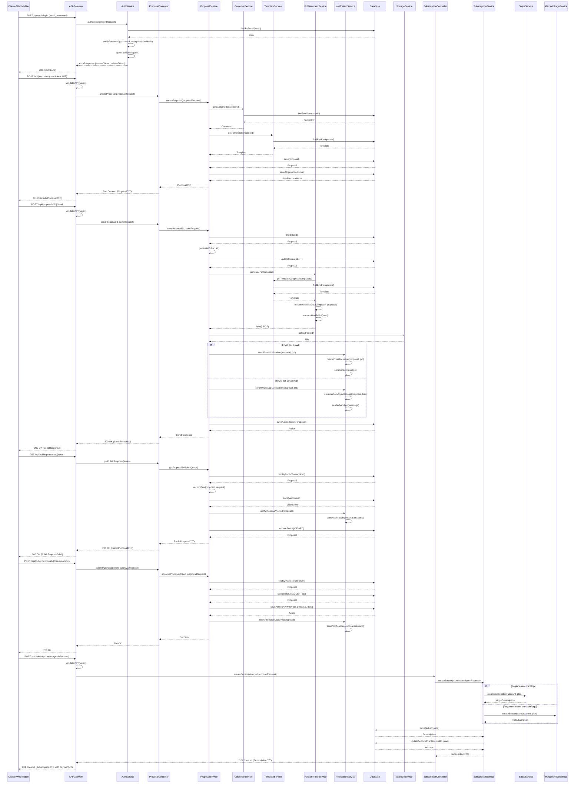

# Sistema de Propostas Comerciais - Design de Arquitetura

## Implementation approach

Após analisar os requisitos do sistema de geração e envio de propostas comerciais em modelo SaaS, identificamos os seguintes pontos críticos que precisarão ser abordados na implementação:

### Pontos críticos de implementação

1. **Arquitetura multi-tenant segura**
   - O sistema precisa garantir isolamento de dados entre diferentes contas/empresas
   - Implementação com PostgreSQL usando discriminadores de tenant_id em cada tabela relacionada

2. **Geração e manipulação de PDFs**
   - Renderização eficiente de templates HTML para PDF com alta qualidade
   - Componentes dinâmicos e personalizáveis mantendo performance

3. **Sistema robusto de controle de acesso**
   - Autenticação JWT com refresh tokens
   - Controle granular de permissões baseado em perfis e recursos

4. **Integração com sistemas de pagamento**
   - Processamento de assinaturas recorrentes (Stripe)
   - Suporte a métodos de pagamento brasileiros (MercadoPago)

5. **Rastreamento de visualizações e eventos**
   - Sistema em tempo real para detectar aberturas de propostas
   - Coleta e processamento de métricas de engajamento

6. **Escalabilidade e performance**
   - Arquitetura que suporte crescimento em número de usuários
   - Otimização de recursos para manter custos controlados

### Frameworks e bibliotecas escolhidas

#### Frontend
- **React + TypeScript**: Framework principal para desenvolvimento da interface
- **Tailwind CSS**: Estilização consistente e design responsivo
- **React Router DOM v6+**: Gerenciamento de rotas e navegação
- **React Hook Form + Zod**: Validação de formulários com tipagem
- **Axios**: Cliente HTTP com interceptadores JWT
- **PDFMake**: Biblioteca para geração de PDFs no cliente
- **ShadCN UI**: Componentes de UI consistentes e acessíveis
- **React Query**: Gerenciamento de estado dos dados da API
- **Zustand**: Gerenciamento de estado global simples

#### Backend
- **Spring Boot 3**: Framework base para o backend
- **Spring Security**: Implementação de autenticação e autorização
- **Spring Data JPA**: ORM para acesso ao banco de dados
- **Flyway**: Migração e versionamento do esquema de banco de dados
- **Thymeleaf**: Geração de templates HTML para e-mails e PDFs
- **OpenPDF/iText**: Biblioteca para manipulação de PDFs no servidor
- **jjwt**: Implementação de JWT para autenticação
- **twilio**: Para integração com WhatsApp Business API
- **Spring AOP**: Para implementação de aspectos multi-tenant

#### Pagamento e Integração
- **Stripe Java SDK**: Para integração com pagamentos recorrentes
- **MercadoPago SDK**: Para métodos de pagamento brasileiros
- **AWS SDK**: Para integração com S3 (armazenamento de arquivos)

#### Infraestrutura
- **Docker/Docker Compose**: Containerização de aplicações
- **GitHub Actions**: CI/CD pipeline
- **PostgreSQL**: Banco de dados principal
- **Redis**: Cache e gestão de sessões

## Data structures and interfaces

O sistema será estruturado em múltiplas camadas, com entidades de domínio bem definidas e APIs RESTful para comunicação entre cliente e servidor.

A seguir, detalhamos as principais classes, interfaces e seus relacionamentos:

```mermaid
classDiagram
    class User {
        <<entity>>
        -Long id
        -String name
        -String email
        -String passwordHash
        -UserRole role
        -Long accountId
        -Boolean active
        -LocalDateTime createdAt
        -LocalDateTime updatedAt
        +User(name, email, password, role, accountId)
        +isAdmin(): Boolean
        +isManager(): Boolean
    }

    class Account {
        <<entity>>
        -Long id
        -String name
        -String segment
        -SubscriptionPlan plan
        -LocalDateTime expirationDate
        -String customDomain
        -Map<String, String> settings
        -LocalDateTime createdAt
        -LocalDateTime updatedAt
        +Account(name, segment, plan)
        +isActive(): Boolean
        +isTrialPeriod(): Boolean
        +daysUntilExpiration(): Integer
    }

    class Customer {
        <<entity>>
        -Long id
        -Long accountId
        -String name
        -String email
        -String phone
        -String company
        -String position
        -String notes
        -LocalDateTime createdAt
        -LocalDateTime updatedAt
        +Customer(name, email, accountId)
        +getFullContactInfo(): String
    }

    class Proposal {
        <<entity>>
        -Long id
        -String title
        -Long customerId
        -Long creatorId
        -Long templateId
        -Long accountId
        -ProposalStatus status
        -BigDecimal totalValue
        -LocalDateTime creationDate
        -LocalDateTime expirationDate
        -String publicUrl
        -String accessPassword
        -Boolean requiresSignature
        -LocalDateTime lastStatusChange
        -Map<String, Object> metadata
        +Proposal(title, customerId, creatorId, templateId, accountId)
        +isExpired(): Boolean
        +getDaysUntilExpiration(): Integer
        +calculateTotalValue(): BigDecimal
        +generatePublicUrl(): String
    }

    class ProposalItem {
        <<entity>>
        -Long id
        -Long proposalId
        -ItemType type
        -String title
        -String description
        -BigDecimal unitValue
        -Integer quantity
        -BigDecimal discount
        -BigDecimal tax
        -Integer displayOrder
        +ProposalItem(proposalId, type, title, unitValue, quantity)
        +calculateSubtotal(): BigDecimal
    }

    class Template {
        <<entity>>
        -Long id
        -String name
        -String description
        -TemplateType type
        -String htmlTemplate
        -String css
        -Boolean isPremium
        -Long accountId
        -String thumbnailUrl
        -TemplateCategory category
        +Template(name, htmlTemplate, isPremium)
        +isCustomTemplate(): Boolean
    }

    class ViewEvent {
        <<entity>>
        -Long id
        -Long proposalId
        -String ip
        -String userAgent
        -LocalDateTime timestamp
        -Integer viewDuration
        -String device
        -String location
        -Map<String, Object> additionalData
        +ViewEvent(proposalId, ip, userAgent)
        +isFirstView(): Boolean
    }

    class Action {
        <<entity>>
        -Long id
        -Long proposalId
        -ActionType type
        -Long userId
        -Long customerId
        -LocalDateTime timestamp
        -Map<String, Object> data
        +Action(proposalId, type, userId)
        +getDescription(): String
    }

    class Subscription {
        <<entity>>
        -Long id
        -Long accountId
        -SubscriptionPlan plan
        -SubscriptionStatus status
        -LocalDateTime startDate
        -LocalDateTime endDate
        -String paymentProviderId
        -String paymentMethod
        -BigDecimal amount
        -String currency
        -Map<String, Object> metadata
        +Subscription(accountId, plan, status, startDate)
        +isActive(): Boolean
        +canAccess(feature): Boolean
    }

    class Payment {
        <<entity>>
        -Long id
        -Long subscriptionId
        -Long accountId
        -BigDecimal amount
        -String currency
        -PaymentStatus status
        -LocalDateTime date
        -String gatewayReference
        -PaymentMethod method
        -String receiptUrl
        +Payment(subscriptionId, accountId, amount, status)
        +isSuccessful(): Boolean
    }

    class File {
        <<entity>>
        -Long id
        -Long accountId
        -String name
        -String path
        -String contentType
        -Long size
        -String storageProvider
        -String storageId
        -FileType type
        -LocalDateTime uploadDate
        +File(name, path, contentType, accountId)
        +getPublicUrl(): String
    }

    class UserRepository {
        <<repository>>
        +findByEmail(email): Optional<User>
        +findByAccountId(accountId): List<User>
        +countByAccountId(accountId): Long
    }

    class ProposalRepository {
        <<repository>>
        +findByAccountId(accountId): List<Proposal>
        +findByCustomerId(customerId): List<Proposal>
        +findByStatus(status): List<Proposal>
        +findByExpirationDateBefore(date): List<Proposal>
        +countByAccountIdAndStatus(accountId, status): Long
    }

    class TemplateRepository {
        <<repository>>
        +findByAccountId(accountId): List<Template>
        +findByIsPremium(isPremium): List<Template>
        +findPublicTemplates(): List<Template>
    }

    class AuthService {
        <<service>>
        -UserRepository userRepository
        -PasswordEncoder passwordEncoder
        -JwtService jwtService
        +authenticate(loginRequest): AuthResponse
        +refreshToken(refreshTokenRequest): AuthResponse
        +register(registerRequest): User
        +validateToken(token): Boolean
    }

    class ProposalService {
        <<service>>
        -ProposalRepository proposalRepository
        -CustomerRepository customerRepository
        -ProposalItemRepository proposalItemRepository
        -ViewEventRepository viewEventRepository
        -PdfGeneratorService pdfGeneratorService
        -NotificationService notificationService
        +createProposal(proposalRequest): Proposal
        +updateProposal(id, proposalRequest): Proposal
        +getProposal(id): ProposalDTO
        +listProposals(filters): Page<ProposalDTO>
        +sendProposal(id, sendRequest): SendResponse
        +generatePublicUrl(id): String
        +generatePdf(id): byte[]
        +recordView(id, viewRequest): ViewEvent
        +approveProposal(id, approvalRequest): Proposal
        +rejectProposal(id, rejectionRequest): Proposal
    }

    class TemplateService {
        <<service>>
        -TemplateRepository templateRepository
        -StorageService storageService
        -AccountService accountService
        +listTemplates(filters): Page<TemplateDTO>
        +getTemplate(id): TemplateDTO
        +createTemplate(templateRequest): Template
        +updateTemplate(id, templateRequest): Template
        +getAvailableTemplates(accountId): List<TemplateDTO>
    }

    class SubscriptionService {
        <<service>>
        -SubscriptionRepository subscriptionRepository
        -AccountRepository accountRepository
        -StripeService stripeService
        -MercadoPagoService mercadoPagoService
        +createSubscription(subscriptionRequest): Subscription
        +updateSubscription(id, subscriptionRequest): Subscription
        +cancelSubscription(id): Subscription
        +handlePaymentWebhook(webhookData): void
        +checkSubscriptionAccess(accountId, feature): Boolean
    }

    class PdfGeneratorService {
        <<service>>
        -TemplateService templateService
        -ThymeleafTemplateEngine templateEngine
        +generatePdf(proposal): byte[]
        +generateHtml(proposal): String
    }

    class NotificationService {
        <<service>>
        -EmailService emailService
        -WhatsAppService whatsappService
        +sendEmailNotification(notification): void
        +sendWhatsAppNotification(notification): void
        +scheduleReminderNotification(proposal, delay): void
    }

    class StorageService {
        <<service>>
        -S3Client s3Client
        -FileRepository fileRepository
        +uploadFile(fileData): File
        +getFileUrl(fileId): String
        +deleteFile(fileId): void
    }

    class AuthController {
        <<controller>>
        -AuthService authService
        +login(loginRequest): ResponseEntity<AuthResponse>
        +refresh(refreshRequest): ResponseEntity<AuthResponse>
        +register(registerRequest): ResponseEntity<UserDTO>
        +forgotPassword(forgotPasswordRequest): ResponseEntity<Void>
    }

    class ProposalController {
        <<controller>>
        -ProposalService proposalService
        +createProposal(proposalRequest): ResponseEntity<ProposalDTO>
        +updateProposal(id, proposalRequest): ResponseEntity<ProposalDTO>
        +getProposal(id): ResponseEntity<ProposalDTO>
        +listProposals(filters): ResponseEntity<Page<ProposalDTO>>
        +sendProposal(id, sendRequest): ResponseEntity<SendResponse>
        +generatePdf(id): ResponseEntity<Resource>
        +getPublicProposal(token): ResponseEntity<PublicProposalDTO>
        +recordView(token, viewRequest): ResponseEntity<Void>
        +submitApproval(token, approvalRequest): ResponseEntity<Void>
    }

    class CustomerController {
        <<controller>>
        -CustomerService customerService
        +createCustomer(customerRequest): ResponseEntity<CustomerDTO>
        +updateCustomer(id, customerRequest): ResponseEntity<CustomerDTO>
        +getCustomer(id): ResponseEntity<CustomerDTO>
        +listCustomers(filters): ResponseEntity<Page<CustomerDTO>>
        +deleteCustomer(id): ResponseEntity<Void>
        +getCustomerProposals(id): ResponseEntity<List<ProposalDTO>>
    }

    class TemplateController {
        <<controller>>
        -TemplateService templateService
        +listTemplates(filters): ResponseEntity<Page<TemplateDTO>>
        +getTemplate(id): ResponseEntity<TemplateDTO>
        +createTemplate(templateRequest): ResponseEntity<TemplateDTO>
        +updateTemplate(id, templateRequest): ResponseEntity<TemplateDTO>
        +deleteTemplate(id): ResponseEntity<Void>
    }

    class SubscriptionController {
        <<controller>>
        -SubscriptionService subscriptionService
        +createSubscription(subscriptionRequest): ResponseEntity<SubscriptionDTO>
        +updateSubscription(id, subscriptionRequest): ResponseEntity<SubscriptionDTO>
        +cancelSubscription(id): ResponseEntity<Void>
        +getAccountSubscription(): ResponseEntity<SubscriptionDTO>
        +getPaymentHistory(): ResponseEntity<List<PaymentDTO>>
    }

    class WebhookController {
        <<controller>>
        -SubscriptionService subscriptionService
        +handleStripeWebhook(payload, signature): ResponseEntity<Void>
        +handleMercadoPagoWebhook(payload): ResponseEntity<Void>
    }

    class JwtRequestFilter {
        <<filter>>
        -JwtService jwtService
        -UserDetailsService userDetailsService
        +doFilterInternal(request, response, filterChain): void
    }

    class TenantFilter {
        <<filter>>
        -TenantContext tenantContext
        +doFilterInternal(request, response, filterChain): void
    }

    User "*" -- "1" Account : pertence >
    Proposal "*" -- "1" Customer : associada >
    Proposal "*" -- "1" User : criada por >
    Proposal "*" -- "1" Template : usa >
    ProposalItem "*" -- "1" Proposal : pertence >
    ViewEvent "*" -- "1" Proposal : registra acesso >
    Action "*" -- "1" Proposal : registra ação >
    Subscription "1" -- "1" Account : associada >
    Payment "*" -- "1" Subscription : pertence >
    File "*" -- "1" Account : pertence >
    Template "*" -- "0..1" Account : pertence >
    
    ProposalService -- ProposalRepository : usa >
    ProposalService -- CustomerRepository : usa >
    ProposalService -- ProposalItemRepository : usa >
    ProposalService -- ViewEventRepository : usa >
    ProposalService -- PdfGeneratorService : usa >
    ProposalService -- NotificationService : usa >
    
    AuthService -- UserRepository : usa >
    TemplateService -- TemplateRepository : usa >
    TemplateService -- StorageService : usa >
    SubscriptionService -- SubscriptionRepository : usa >
    
    PdfGeneratorService -- TemplateService : usa >
    NotificationService -- EmailService : usa >
    NotificationService -- WhatsAppService : usa >
    
    ProposalController -- ProposalService : usa >
    CustomerController -- CustomerService : usa >
    TemplateController -- TemplateService : usa >
    AuthController -- AuthService : usa >
    SubscriptionController -- SubscriptionService : usa >
    WebhookController -- SubscriptionService : usa >
```

## Program call flow

A seguir, apresentamos os principais fluxos de chamada do sistema, abrangendo as operações mais importantes como autenticação, criação e envio de propostas, e monitoramento de visualizações.

## Anything UNCLEAR

### Pontos a esclarecer:

1. **Integração WhatsApp**: O PRD menciona integração com WhatsApp, mas não especifica se deve ser usado o WhatsApp Business API diretamente ou algum serviço intermediário como Twilio. Recomendamos usar o Twilio pela facilidade de implementação, mas é necessário verificar os requisitos de volume e custo.

2. **Assinatura digital com validade jurídica**: É mencionado como recurso premium, mas não especifica qual provedor deve ser usado (DocuSign, D4Sign, etc). Para o mercado brasileiro, recomendamos verificar a integração com um provedor que atenda à legislação local.

3. **Limites de armazenamento**: Os planos definem limites de armazenamento, mas não especificam como o sistema deve se comportar quando o limite é atingido. Sugerimos implementar alertas quando o uso chegar a 80% e impedir novos uploads quando o limite for atingido.

4. **Estratégia de backup e recuperação**: O PRD não menciona requisitos específicos para backup e recuperação de desastres. Recomendamos implementar backups diários automatizados para o banco de dados e armazenamento de arquivos.

5. **Métricas de monitoramento**: Embora o sistema deva rastrear eventos de visualização, não está claro quais métricas operacionais devem ser monitoradas para garantir a saúde do sistema. Sugerimos implementar monitoramento de performance, disponibilidade e uso de recursos.

6. **Requisitos de LGPD**: O PRD menciona conformidade com LGPD, mas não detalha requisitos específicos como política de retenção de dados, processos de exclusão, etc. Recomendamos desenvolver uma estratégia completa de compliance com LGPD.

Para atender a esses pontos, sugerimos uma reunião de esclarecimento para definição final antes do início da implementação.